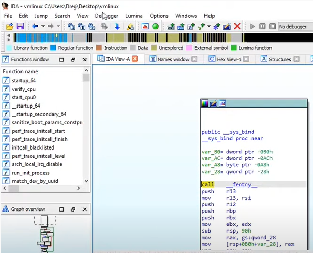

# linux kernel debug and disassemble with ida and vmware

Helper script for Linux kernel debugging with IDA Pro on VMware + GDB stub (including some symbols helpers)



Examples, tools & POCs:
* **Disassemble** stripped-kernel + resolving symbols from: system.map **or** nm output **or** /proc/kallsyms output
* **Debug** stripped-kernel + resolving symbols from /proc/kallsyms output
* **Debug** stripped-kernel + resolving symbols from own pattern-finder-ring0-LKM, example: lkmsym/lkmsym.c

**linux_kernel_symloader.py**: For python3 + idapython 7.4. It make symbols in IDA from system.map **or** nm output **or** /proc/kallsyms output **or** pattern-finder-ring0-LKM example. It also creates **MANUAL MEMORY REGIONS** for you (then you can JUMP TO E/RIP without problems).

**WARNING**: the ugliest code in the world, I have developed this just for my own needs, you can improve the project via PR.

# Youtube video with example of usage:

https://www.youtube.com/watch?v=l9wKi9_3KrI

# Tools

* **dump_kallsyms.sh**: show & dump symbols from /proc/kallsyms to dump_kallsyms file (in current dir)
* **vmlinuxsystemap.sh**: copy current kernel vmlinuz & system.map to current directory from /boot. It also extracts to current directory the ELF (vmlinux) from vmlinuz file.
* **lkmsym/dumpsyms.sh**: load pattern-finder-ring0-LKM and dump kernel symbols to symbols file (in current dir)
* **lkmsym/compiletry.sh**: compile pattern-finder-ring0-LKM and executes lkmsym/dumpsyms.sh

# Deps

```
root@debian# apt-get install build-essential
```

# Debian kernel with debug info

```
root@debian# apt-get install linux-image-$(uname -r)-dbg

dreg@debian# file /usr/lib/debug/boot/vmlinux-$(uname -r)
```
/usr/lib/debug/boot/vmlinux-4.19.0-10-amd64: ELF 64-bit LSB executable, x86-64, version 1 (SYSV), statically linked, BuildID[sha1]=b28d236fad2fb7d0eb9bbe6eac766fb04406da3f, **with debug_info, not stripped**

```
dreg@debian# nm /usr/lib/debug/boot/vmlinux-$(uname -r) | tail
ffffffff8207d7c0 d zswap_same_filled_pages_enabled
ffffffff8262b54c b zswap_stored_pages
ffffffff8262b420 b zswap_trees
ffffffff81225df0 t zswap_update_total_size
ffffffff81226a50 t zswap_writeback_entry
ffffffff8262b538 b zswap_written_back_pages
ffffffff81c41fb8 r zswap_zpool_ops
ffffffff8207d7e0 d zswap_zpool_param_ops
```

# Debian linux headers & kernel sources

```
root@debian# apt-get install linux-headers-$(uname -r)

root@debian# apt-get install linux-source

dreg@debian# ls /usr/src/
linux-config-4.19              linux-headers-4.19.0-10-common  linux-patch-4.19-rt.patch.xz  
linux-headers-4.19.0-10-amd64  linux-kbuild-4.19               linux-source-4.19.tar.xz

dreg@debian# cd /usr/src/ && tar -xf linux-source-4.19.tar.xz && ls linux-source-4.19/
arch   certs    CREDITS  Documentation  firmware  include  ipc     Kconfig  lib       MAINTAINERS  mm   README   scripts   sound  usr
block  COPYING  crypto   drivers        fs        init     Kbuild  kernel   LICENSES  Makefile     net  samples  security  tools  virt
```

# New entries in .vmx 

**WARNING: use only debugOnStartGuest if you want start debugging immediately on BIOS load**

## for x64 .vmx

debugStub.hideBreakpoints= "TRUE"

debugStub.listen.guest64 = "TRUE"

monitor.debugOnStartGuest64 = "TRUE"

debugStub.port.guest64 = "8864"


## for x32 .vmx

debugStub.hideBreakpoints= "TRUE"

debugStub.listen.guest32 = "TRUE"

monitor.debugOnStartGuest32 = "TRUE"

debugStub.port.guest32 = "8832"

# Example of use

1. Open IDA PRO, start a debug session (go to Debugger -> Attach -> Remote GDB debugger)
2. File -> Script File -> linux_kernel_symloader.py

This script ask you for symbol file

# Other info

How to Disable KASLR from boot? add **nokaslr** to GRUB_CMDLINE_LINUX_DEFAULT:
```
dreg@debian# cat /etc/default/grub
# If you change this file, run 'update-grub' afterwards to update
# /boot/grub/grub.cfg.
# For full documentation of the options in this file, see:
#   info -f grub -n 'Simple configuration'

GRUB_DEFAULT=0
GRUB_TIMEOUT=5
GRUB_DISTRIBUTOR=`lsb_release -i -s 2> /dev/null || echo Debian`
GRUB_CMDLINE_LINUX_DEFAULT="quiet splash nokaslr"
GRUB_CMDLINE_LINUX=""
```

Execute update-grub
```
root@debian# update-grub
```

# Tested

* Hosts: 
    - Windows 10 10.0.19041 Build 19041
    - Windows 10 10.0.19041 Build 19041
    - Windows 10 10.0.19044 Build 19044
* Guests: 
    - Debian 10 4.19.0-10-amd64
    - Debian 11 5.10.0-16-amd64
* VMware Workstation:
    - 16 Pro 10.0.19041 Build 19041
    - 16 Pro 16.0.0 build-16894299
    - 16 Pro 16.2.3 build-19376536
    - 16 Pro 16.2.4 build-20089737
* IDA Pro x64 Windows:
    - 7.5.200519
    - 7.5.200728 
    - 7.7.220218

# Some possible problems

How to solve Crash after resuming execution from gdb stub and/or crash after breakpoint:

```
The crash is in ulm.c

Without more details, part of it means that I'm guessing here, but there's a very high probability that it stands for "User Level Monitor" as it does elsewhere whenever VMware mentions "ulm".

As such that means your VM is running on a host with Hyper-V mode enabled.

That codepath is pretty new and is most likely why you are getting this issue.
The most likely workaround would be to disable Hyper-V mode at the host level.
This might not be an option for you though.

If it is then the steps to disable the Hyper-V role is to run the following command at the host in windows command-line with Administrator privileges:

bcdedit /set hypervisorlaunchtype off
Reboot the system to activate it.

If you want to go back to Hyper-V mode again, then you can enable it like this:

bcdedit /set hypervisorlaunchtype auto
 

hope this helps,
```

- https://communities.vmware.com/t5/VMware-Workstation-Pro/Crash-after-resuming-execution-from-gdb-stub/td-p/2824667

# Related

Helper script for Windows kernel debugging with IDA Pro on VMware + GDB stub (including PDB symbols):
- https://github.com/therealdreg/ida_vmware_windows_gdb

Helper script for Windows kernel debugging with IDA Pro on native Bochs debugger:
- https://github.com/therealdreg/ida_bochs_windows

# References

https://www.hex-rays.com/wp-content/uploads/2019/12/debugging_gdb_linux_vmware.pdf
 
https://blog.packagecloud.io/eng/2016/03/08/how-to-extract-and-disassmble-a-linux-kernel-image-vmlinuz/

https://www.triplefault.io/2017/07/setup-vmm-debugging-using-vmwares-gdb_9.html

https://stackoverflow.com/questions/37978245/how-to-dump-list-all-kernel-symbols-with-addresses-from-linux-kernel-module

https://github.com/marin-m/vmlinux-to-elf

